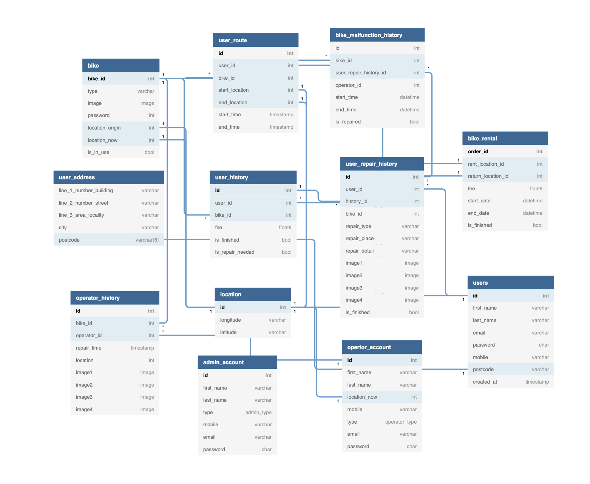

# Bike Share

# 💡 Topic

- A service for **all stakeholders for hiring a bike** (admin, user and operator)
- Assessment of MSc Team Project

# 📝 Summary

Bike Share is aimed to encourage students and citizens to try shared bicycle service on a short-term basis for a price. There are several bike station where users are able to take bikes. It is convenient for users to top up their account to hire a bike. Once a bike is hired, the system keeps track of the bike to take to the station. When any defectives found by users, operators check and repair the bike.

## Entity Relationship Diagram (ERD)
