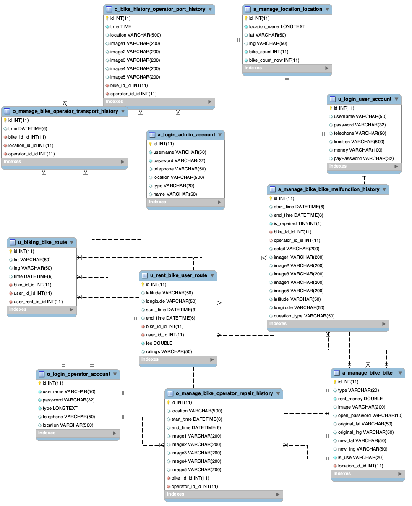

# Getting Started With Bike Share System

With this bike share system, You will experience how easy to find out where the bikes are around you and check in/out whenever and wherever needed.
What you need for this system is your credential id/pw (provided in User Documentation Section in the paper). It is easy pay-and-go system.

## How To Navigate To Bike Share System
Simply direct to html address &#8594; [https://bike-share-psd.herokuapp.com](https://bike-share-psd.herokuapp.com)

(Works the same way you set up locally)

## How To Set Up Locally On Your Machine

### Mac version

1. Run the followings to clone the repo
    ```bash
    git clone https://stgit.dcs.gla.ac.uk/psdm/2020/lab-02-1c/lab02_group_1c_bike_share_system.git
    cd lab02_group_1c_bike_share_system
    source bin/activate
    pip install -r requirements.txt
    ```


2. Open the project with *PyCharm*
   
3. Go to `Preference > Project Interpreter` and Check if Python Interpreter downloaded its dependencies as follows
   
   

4. Go to `Edit Configurations` and Set as follows
   * Script path as `lab02_group_1c_bike_share_system/src/manage.py`
   * Parameters as `runserver`
   * Python interpreter as `Python 3.8`; the one you set in step 4
   * working directory as `lab02_group_1c_bike_share_system/src`
   
   

5. Run the server!
   
* Install mysql if you encounter `'_mysql' is not defined` error
    ```bash
    brew install mysql
    brew install mysql-connector-c
    ```

### Windows version

In order to build this project on Windows we will use GitBash and Python

1. Run the following command to clone the repo
    ```
    git clone https://stgit.dcs.gla.ac.uk/psdm/2020/lab-02-1c/lab02_group_1c_bike_share_system.git
    ```
    
2. Navigate to the repository folder and create a virtual environment to host the application
    ```
    cd  lab02_group_1c_bike_share_system
    python -m venv env
    source env/Scripts/activate
    pip install -r requirements.txt
    ```
    
4. Navigate to the folder where 'manage.py' is located and run the server
    ```
    cd src
    python manage.py runserver
    ```

## Entity Relationship Diagram (ERD)
